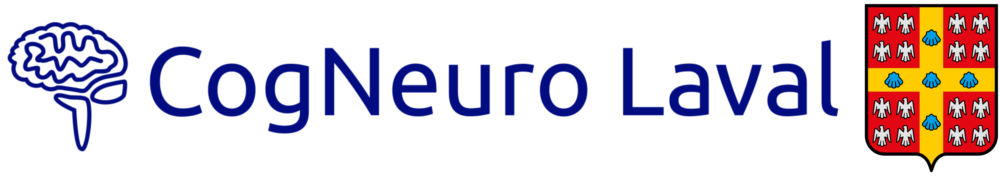

# CogNeuro Laval

## Membres étudiant.e.s

Carole Bélanger (Étudiante au doctorat en psychologie, Automne 2022-...)

## Membres profeseur.e.s

Isabelle Blanchette (Professeure, Automne 2022-...) 
Michel-Pierre Coll (Professeur, Automne 2023-...) 
François Vachon (Professeur, Automne 2022-...) 
<!-- 

[Wasita Mahaphanit](https://wasita.space/) (Fall 2022) graduated from Brown University with a BS in Cognitive Neuroscience. She managed a lab at Brown after graduation, where she investigated the behavioral and computational mechanisms underlying learning and decision-making under uncertainty in healthy adults and patients with obsessive compulsive disorder. She currently works in the [COSAN Lab](http://cosanlab.com/), where she studies how we learn social cognitive maps and use this information in how we communicate and make decisions. -->

